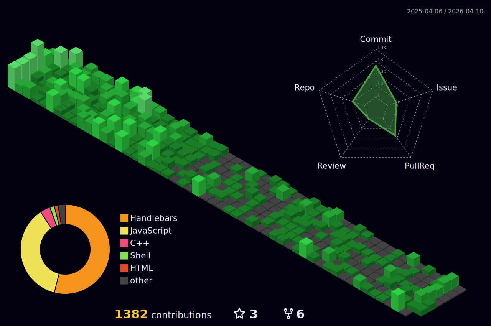

    

 

    

 

<h1 align="center">Muhammad Bin Khalid</h1>

Student • Full Stack Developer • Indie App & Game Developer

I am a passionate student and developer with hands-on experience in building web applications, system-level programs, and interactive apps using Unity.
My work spans C++, C#, Java, HTML, CSS, Node.js, and related technologies.

As an independent developer, I enjoy crafting meaningful projects and actively contributing to open-source.
I strongly believe in collaboration, clean engineering practices, and sharing knowledge to help others grow.

    🌐 <a href="https://mbktech.org" target="_blank"><b>Visit MBKTech.org</b></a>

---

<h2 align="center">Technologies & Tools 🔧</h2>

<!-- Languages & Core Tech -->

    

---

<h2 align="center">GitHub Stats ⚡️</h2>

<table align="center" style="border:none;">
    <tr>
        <td style="border:none;">
            
        </td>
        <td style="border:none;">
            
        </td>
        <td style="border:none;">
            
        </td>
    </tr>
</table>

 

<table align="center" style="border:none;">
    <tr>
        <td style="border:none;">
            
        </td>
    </tr>
</table>

 

    

 

<table align="center" style="border:none;">
    <tr>
        <td style="border:none;">
            
        </td>
    </tr>
</table>

---

<h2 align="center">Connect With Me ✉️</h2>

    
    
    
    
    

    📧 Email: 
    <a href="mailto:chmuhammadbinkhalid28@gmail.com">chmuhammadbinkhalid28@gmail.com</a> | 
    <a href="mailto:support@mbktech.org">support@mbktech.org</a>
     
    💬 Contact form: <a href="https://mbktech.org/Support" target="_blank">mbktech.org/Support</a>

