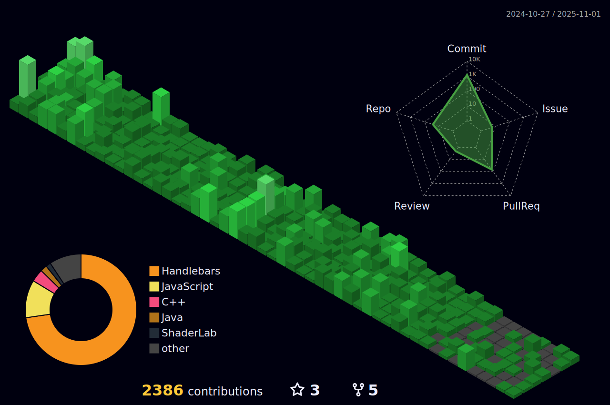

    
 

  
 

    
 

 

    <h1 align="center">I'm Muhammad Bin Khalid</h1>
 

  

I Am A Student, Full Stack Developer And Indie Game Developer With Experience In Unity, C++, C#, HTML, CSS, Node.Js, React etc.

As An Independent Developer, I Am Passionate About Crafting Meaningful Projects And Contributing To The Open-Source Community. I Believe In The Power Of Collaboration And Sharing Knowledge To Empower Others.

 

    <a href="https://mbktech.org" target="_blank"><b>Visit MBKTech.org</b></a> |
    <a href="https://ibnekhalid.me" target="_blank"><b>Portfolio</b></a>
 

 <h2 align="center">
    Technologies 🔧
 </h2>
 

    
    
 

 <h2 align="center">
    Stats ⚡️
 </h2>
 <table style="border:none;margin:0 auto" align="center">
    <tr style="border:none;">
       <td style="border:none;">
          
       </td>
       <td style="border:none;">
          
       </td>
       <td style="border:none;">
          
       </td>
    </tr>
 </table>
 <table style="border:none;margin:0 auto" align="center">
    <tr style="border:none;margin:0 auto" align="center">
       <td style="border:none;">
          
       </td>
    </tr>
 </table> 
    
   <table style="border:none;margin:0 auto" align="center">
    <tr style="border:none;">
       <td style="border:none;">
        <!--   -->
             
       </td>
    </tr>
 </table>
 <!--
 <table style="border:none;margin:0 auto" align="center">
    <tr style="border:none;margin:0 auto" align="center">
       <td style="border:none;">
          
       </td>
        <td style="border:none;">
          
       </td>
    </tr>
 </table>
 -->
 <!--
 <table style="border:none;margin:0 auto" align="center">
    <tr style="border:none;">
       <td style="border:none;"> 
             
       </td>
    </tr>
 </table>
  <table style="border:none;margin:0 auto" align="center">
    <tr style="border:none;margin:0 auto" align="center">
       <td style="border:none;">
          
       </td>
    </tr>
 </table>
 <table style="border:none;margin:0 auto" align="center">
    <tr style="border:none;">
       <td style="border:none;"> 
             
       </td>
    </tr>
 </table>
-->
 

 <h2 align="center">
    Connect With Me ✉️️
 </h2>
 
  
     
     
     
    
      
 

 

    📧 You can reach me via email at <a href="mailto:chmuhammadbinkhalid28@gmail.com">chmuhammadbinkhalid28@gmail.com</a> or <a href="mailto:support@mbktech.org">support@mbktech.org</a>.  
     
    💬 Alternatively, submit a contact form at <a href="https://mbktech.org/Support" target="_blank">mbktech.org/Support</a>.
 

 <!--
    <h3 align="left">Conntact Us:</h3>
    

    
    
    
    
    
    
    
    

    -->
 <!--
    <h3 align="left">Support:</h3>
    

  
    -->
